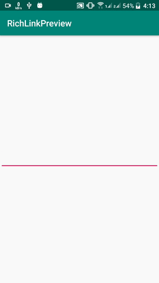

# RICHLINK PREVIEW
## Android RichLink Preview Library

#### Example




#### Implementation

In XML

```
<com.qkopy.richlink.RichLinkViewQkopy
            android:id="@+id/richLink"
            android:layout_width="match_parent"
            android:layout_height="wrap_content"
            app:layout_constraintBottom_toTopOf="@id/edittext"
            android:layout_marginBottom="10dp"
          />
```

In Your Activity

```
richLink.setLink("your-url",this@MainActivity, object : ViewListener {
          override fun onSuccess(status: Boolean) {

          }

          override fun onError(e: Exception) {

          }
})
```

Setting a Custom Click listener

```
richLink.setDefaultClickListener(true)

 richLink.setClickListener(object : RichLinkListener {
    override fun onClicked(view: View, meta: MetaData?) {
       TODO("Not yet implemented")
    }
})
```
